# 🗺️ MeetTutorials Recommended Study Roadmap

Welcome to the official study roadmap for **MeetTutorials**! This roadmap is designed to guide a complete beginner from writing their very first HTML tag to building production-ready full-stack applications and landing a developer role.

We recommend dedicating **15–20 hours per week** to follow this schedule. Do not rush—ensure you complete the practice and challenge tasks for every topic before moving forward!

---

## 📅 Timeline Overview

```mermaid
gantt
    title MeetTutorials Learning Timeline
    dateFormat  X
    axisFormat %d
    section Frontend Foundation
    HTML & CSS (Weeks 1-2)              :active, 0, 14
    JavaScript (Weeks 3-4)              : 14, 28
    Git & GitHub (Week 5)               : 28, 35
    section Modern Frontend
    Bootstrap & Tailwind (Week 6)       : 35, 42
    React Framework (Weeks 7-8)         : 42, 56
    section Backend Stack
    NodeJS & ExpressJS (Weeks 9-10)     : 56, 70
    MongoDB NoSQL (Week 11)             : 70, 77
    section Full-Stack Integration
    MERN Integration (Weeks 12-13)      : 77, 91
    Capstone Projects (Weeks 14+)       : 91, 105
    section Career Ready
    Interview, DSA & Mindset (Weeks 15+): 105, 120
```

---

## 🚀 Week-by-Week Learning Path

### 🔌 Week 0: Developer Environment Setup
*   **Target**: [00-DEVELOPER-SETUP](file:///d:/Meet%20Tutorials/MeetTutorials/00-DEVELOPER-SETUP)
*   **Focus**: Install VS Code, Node.js, Git bash console, configure terminal profiles, and select developer fonts.

---

### 🧱 Week 1: Semantic HTML5
*   **Target**: [01-HTML](file:///d:/Meet%20Tutorials/MeetTutorials/01-HTML)
*   **Focus**: Learn document skeleton structures, semantic tags, forms, accessibility (a11y), and search engine optimization (SEO) basics.
*   **Milestone**: Build the **Recipe Page** and **Feedback Survey Form** mini-projects.

---

### 🎨 Week 2: Responsive CSS3
*   **Target**: [02-CSS](file:///d:/Meet%20Tutorials/MeetTutorials/02-CSS)
*   **Focus**: Box model, positioning, Flexbox, CSS Grid layouts, media queries, transitions, and keyframe animations.
*   **Milestone**: Build a **Responsive Personal Landing Page** from scratch.

---

### ⚡ Weeks 3–4: Core JavaScript (ES6+)
*   **Target**: [03-JAVASCRIPT](file:///d:/Meet%20Tutorials/MeetTutorials/03-JAVASCRIPT)
*   **Focus**: Variables, functions, arrays operations, DOM manipulation, async flow (Promises, async/await), and Fetch API.
*   **Milestone**: Build a **Weather Widget** querying public APIs.

---

### 🐙 Week 5: Version Control (Git & GitHub)
*   **Target**: [04-GIT](file:///d:/Meet%20Tutorials/MeetTutorials/04-GIT) & [05-GITHUB](file:///d:/Meet%20Tutorials/MeetTutorials/05-GITHUB)
*   **Focus**: Initializing repositories, commits staging, branching, resolving merge conflicts, forks, issues, and opening Pull Requests.
*   **Milestone**: Host your personal website live using **GitHub Pages**.

---

### 💅 Week 6: UI Frameworks (Bootstrap & Tailwind CSS)
*   **Target**: [06-BOOTSTRAP](file:///d:/Meet%20Tutorials/MeetTutorials/06-BOOTSTRAP) & [07-TAILWIND](file:///d:/Meet%20Tutorials/MeetTutorials/07-TAILWIND)
*   **Focus**: Rapid prototyping using grid containers, spacing scales, typography variables, utility-first classes, and hover states.
*   **Milestone**: Build a premium responsive **Dashboard UI** using Tailwind CSS.

---

### ⚛️ Weeks 7–8: React Framework
*   **Target**: [08-REACT](file:///d:/Meet%20Tutorials/MeetTutorials/08-REACT)
*   **Focus**: JSX, component hierarchies, state and props, React Hooks (`useState`, `useEffect`, `useContext`), lifting state, and `React-Router-DOM`.
*   **Milestone**: Build an offline-first **Expense Tracker** app.

---

### 🟢 Weeks 9–10: Backend Services (Node.js & Express.js)
*   **Target**: [09-NODEJS](file:///d:/Meet%20Tutorials/MeetTutorials/09-NODEJS) & [10-EXPRESSJS](file:///d:/Meet%20Tutorials/MeetTutorials/10-EXPRESSJS)
*   **Focus**: File system modules, NPM, creating HTTP servers, routing endpoints, request body parsing, middlewares, and JWT Authentication.
*   **Milestone**: Build a secure RESTful **Notes API** with password hashing (`bcrypt`).

---

### 💾 Week 11: NoSQL Databases (MongoDB)
*   **Target**: [11-MONGODB](file:///d:/Meet%20Tutorials/MeetTutorials/11-MONGODB)
*   **Focus**: Documents operations (CRUD), query filter operators, index scans optimization, aggregations, and Mongoose schemas mapping.
*   **Milestone**: Design and seed a relational **Student & Course Database** layout.

---

### 🔌 Weeks 12–13: Full-Stack MERN Integration & Deployment
*   **Target**: [12-MERN](file:///d:/Meet%20Tutorials/MeetTutorials/12-MERN)
*   **Focus**: CORS credentials routing, integrating frontend state hooks with backend APIs, JWT cookies, and deploying apps to Render and Vercel.
*   **Milestone**: Build a complete, functional **Task Manager** dashboard.

---

### 🏆 Weeks 14+: Capstone Projects
*   **Target**: [13-CAPSTONE-PROJECTS](file:///d:/Meet%20Tutorials/MeetTutorials/13-CAPSTONE-PROJECTS)
*   **Focus**: Build, polish, and host production-grade full-stack systems.
*   **Projects**:
    1.  **Portfolio Website**: Your personal developer showcase page.
    2.  **Blog System**: A Markdown blog engine with embedded comment sections.
    3.  **Task Manager**: A collaborative work task board with priority status tags.
    4.  **Expense Tracker**: A personal finance dashboard with MongoDB aggregations stats.
    5.  **Ecommerce Store**: Catalog storefront with shopping cart client state filters.

---

### 💼 Weeks 15+: Career Readiness & Optimization
*   **Target**: [14-INTERVIEW-PREP](file:///d:/Meet%20Tutorials/MeetTutorials/14-INTERVIEW-PREP), [16-SYSTEM-DESIGN-BASICS](file:///d:/Meet%20Tutorials/MeetTutorials/16-SYSTEM-DESIGN-BASICS), [17-CAREER-GUIDE](file:///d:/Meet%20Tutorials/MeetTutorials/17-CAREER-GUIDE), [18-OPEN-SOURCE](file:///d:/Meet%20Tutorials/MeetTutorials/18-OPEN-SOURCE), [19-DSA-FOR-WEB-DEVS](file:///d:/Meet%20Tutorials/MeetTutorials/19-DSA-FOR-WEB-DEVS), [20-DEVELOPER-MINDSET](file:///d:/Meet%20Tutorials/MeetTutorials/20-DEVELOPER-MINDSET)
*   **Focus**:
    -   **DSA**: Focus on junior-friendly web development data structures (HashMaps, Arrays, Stacks, Queues) and Big O efficiency analysis.
    -   **System Design**: Client-Server lifecycles, load balancers, caching validation, CDNs, and Stateless JWT vs Sessions authentication.
    -   **Career Guide**: ATS Resume optimizations, LinkedIn SEO discovery settings, Salary Negotiation protocols, and Remote Work asynchronous routines.
    -   **Open Source**: Forking, writing detailed issues templates, code review cycles, and landing your first public merges.
    -   **Developer Mindset**: Systematic debugging, reading documentation, and avoiding tutorial hell.

---

> [!TIP]
> Keep the [15-CHEATSHEETS](file:///d:/Meet%20Tutorials/MeetTutorials/15-CHEATSHEETS) bookmarks open as a printable wall-poster reference card while coding throughout the entire roadmap!
