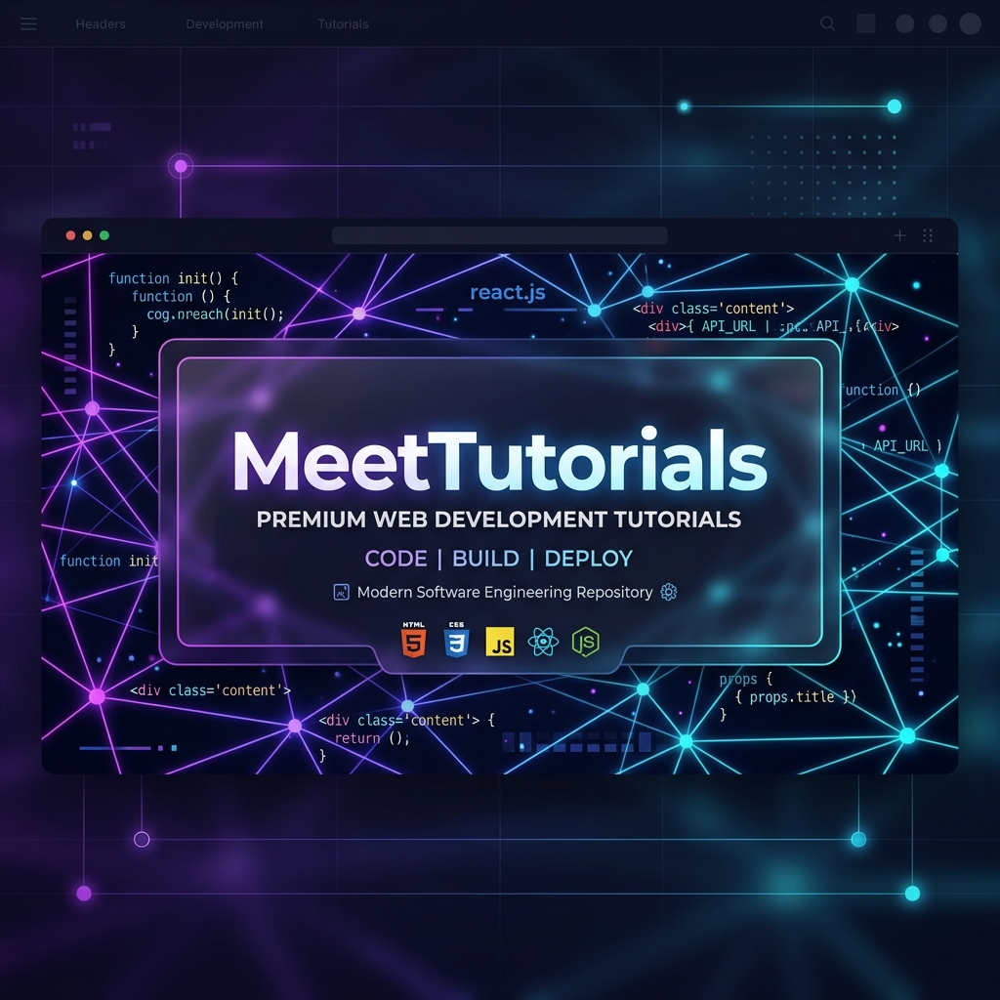

⭐ If this repository helps you learn web development,
please consider starring the repository on GitHub.

# 🚀 MeetTutorials

MeetTutorials is the world's most beginner-friendly, cloneable MERN stack learning repository designed to teach web development from absolute scratch. 

Instead of reading dry text, this repository is designed so you can clone the code, read the explanations, run the examples, and solve the practice challenges directly on your local computer.

---

## 💡 Why MeetTutorials Exists

Traditional tutorials are either overly theoretical or provide only a single minimal example, leaving beginners stranded when they try to build real-world software. 

MeetTutorials bridges this gap by providing:
*   **Analogy-First Learning**: Every concept is introduced with a real-world analogy before diving into code.
*   **Complete Coverage**: We teach all variations, methods, and edge cases, not just the simplest syntax.
*   **Strict 6-File Schema**: Every single topic follows the exact same folder structure, providing immediate familiarity.
*   **Runnable Code Examples**: Students can run and inspect the files locally on their machines.
*   **Actionable Challenges**: Exercises are split into practice tasks and harder challenge assignments.

---

## 📈 Repository Statistics

Below is the summary of the generated codebase, calculated dynamically by scanning the repository:

*   **Total Learning Sections**: `21` (00 Setup phase + 20 curriculum phases)
*   **Total Topics Covered**: `297` modules
*   **Total Lessons**: `271` concept guides
*   **Total Projects**: `33` hands-on exercises (including Capstones)
*   **Total Files**: `1782` generated files
*   **Technologies Covered**: `12` core developer tools
*   **Estimated Completion Time**: `250 - 300 Hours` (15 - 18 Weeks)

---

## 🛠️ Technologies Covered

*   **HTML5** - Structure the Web
*   **CSS3** - Style the Web (Flexbox, Grid, transitions, animations)
*   **JavaScript** - Power the Web (ES6+, DOM actions, async/await, fetch APIs)
*   **Git** - Save version histories and coordinate commits locally
*   **GitHub** - Remote code sharing, issues tracking, forks, and pull requests
*   **Bootstrap 5** & **Tailwind CSS** - Modern, responsive CSS frameworks
*   **React JS** - Component design, props, state, hooks, client routing
*   **Node.js** - Asynchronous JavaScript runtime environment
*   **Express.js** - Server-side REST APIs & request filtering middlewares
*   **MongoDB** - NoSQL database document persistence, aggregates, index tuning
*   **MERN Stack** - Glued frontend-backend integration, JWT cookies, and deployments

---

## 🏆 Project Showcase

Here are the key full-stack and capstone projects featured in the curriculum:

1.  **[Portfolio Website](file:///d:/Meet%20Tutorials/MeetTutorials/13-CAPSTONE-PROJECTS/01-Portfolio-Website)**
    *   *What it is*: A single-file full-stack developer portfolio page.
    *   *Highlights*: Features a React submission contact form, Express route handlers, and CORS header whitelists.
2.  **[Task Manager (MERN)](file:///d:/Meet%20Tutorials/MeetTutorials/13-CAPSTONE-PROJECTS/03-Task-Manager)**
    *   *What it is*: A collaborative task board with priority and status columns.
    *   *Highlights*: Integrates user-ownership data boundaries, priority filters, and full CRUD workflows.
3.  **[Expense Tracker (MERN)](file:///d:/Meet%20Tutorials/MeetTutorials/13-CAPSTONE-PROJECTS/04-Expense-Tracker)**
    *   *What it is*: A personal financial tracking ledger.
    *   *Highlights*: Uses MongoDB aggregation query pipelines to compute category averages and total spending balances.
4.  **[Mini Ecommerce (MERN)](file:///d:/Meet%20Tutorials/MeetTutorials/13-CAPSTONE-PROJECTS/05-Ecommerce-Store)**
    *   *What it is*: A functional online store catalogue with a shopping cart.
    *   *Highlights*: Features case-insensitive database searches, category filters, and checkout stock-deduction logic.
5.  **[Blog System (Capstone)](file:///d:/Meet%20Tutorials/MeetTutorials/13-CAPSTONE-PROJECTS/02-Blog-System)**
    *   *What it is*: A Markdown-powered article and comments platform.
    *   *Highlights*: Implements blog database routing with embedded comments arrays inside Mongoose schemas.

---

## 🗺️ Learning Path

Move step-by-step from zero to a job-ready developer following our path:

```text
[00-DEVELOPER-SETUP]      <-- Config VS Code, Node environment, Git
       │
[01-HTML & 02-CSS]        <-- Web structure, styling, responsive layouts
       │
[03-JAVASCRIPT]           <-- Program logic, DOM controls, events, Fetch APIs
       │
[04-GIT & 05-GITHUB]      <-- Branching, commits, remote cloud repositories
       │
[06-BOOTSTRAP/07-TAILWIND] <-- Rapid styling, layout utility engines
       │
[08-REACT]                <-- Single Page Apps, component states, hooks
       │
[09-NODEJS/10-EXPRESSJS]  <-- Low-level runtimes, HTTP routing, controllers
       │
[11-MONGODB]              <-- NoSQL collections, indexes, aggregates, schemas
       │
[12-MERN]                 <-- Connecting Client to Server APIs & Deployments
       │
[13-CAPSTONE-PROJECTS]    <-- Full-stack production portfolios
       │
[14-INTERVIEW-PREP]       <-- Flashcards, technical questions, HR practice
       │
[15-CHEATSHEETS]          <-- Printable cheatsheet cards references
       │
[16-SYSTEM-DESIGN-BASICS] <-- Server configurations, CDNs, load balancing
       │
[17-CAREER-GUIDE]         <-- Resume tips, LinkedIn SEO, Salary negotiation
       │
[18-OPEN-SOURCE]          <-- Forks, Pull Requests, code review workflows
       │
[19-DSA-FOR-WEB-DEVS]     <-- Junior-focused search/sort algos, memory models
       │
[20-DEVELOPER-MINDSET]    <-- System debugging, documentation guides
```

---

## 💻 How To Use

1.  **Set up your environment**: Read **[START-HERE.md](file:///d:/Meet%20Tutorials/MeetTutorials/START-HERE.md)**.
2.  **Open in VS Code**: Open the cloned `MeetTutorials` folder on your computer.
3.  **Read and Code**: Inside each topic, open `01-quick-guide.md` to understand the concept, then open `02-example.*` and run it using the Live Server extension.
4.  **Solve the Tasks**: Complete `03-practice-task.md` and test your skills with the harder `04-challenge-task.md`.
5.  **Review the Code**: Keep the **[verify.js](file:///d:/Meet%20Tutorials/MeetTutorials/verify.js)** validator file handy to check directory formatting structures.

---

## 📅 Recommended Learning Order

For a detailed week-by-week study timeline, refer to **[LEARNING-ORDER.md](file:///d:/Meet%20Tutorials/MeetTutorials/LEARNING-ORDER.md)**.

---

## 🤝 Contribution Guide

We welcome community suggestions, edits, and additional projects! Please read **[CONTRIBUTING.md](file:///d:/Meet%20Tutorials/MeetTutorials/CONTRIBUTING.md)** for our folder naming guidelines, the 6-file schema rules, and PR merge requirements.

---

## 📜 License

This project is licensed under the terms of the MIT License. To read the full permission text, check **[LICENSE](file:///d:/Meet%20Tutorials/MeetTutorials/LICENSE)**.

---

## 🚀 Future Roadmap

Future development work on MeetTutorials focuses on:
*   🐛 **Bug Fixes**: Resolving any typos or logic errors reported by users.
*   ⭐ **Additional Projects**: Adding complex full-stack templates.
*   🌐 **Translation Support**: Translating directories into Spanish, Hindi, and Mandarin.
*   🎥 **Video Companion**: Providing visual video lectures walking through each phase.
